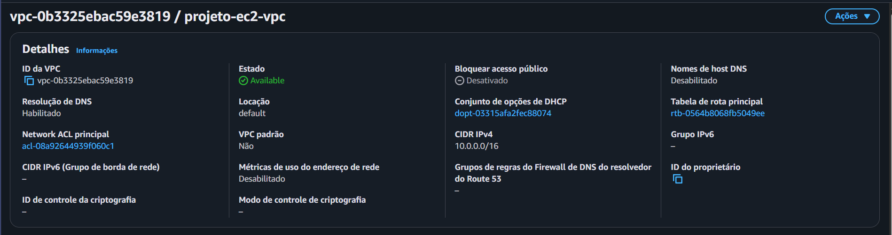
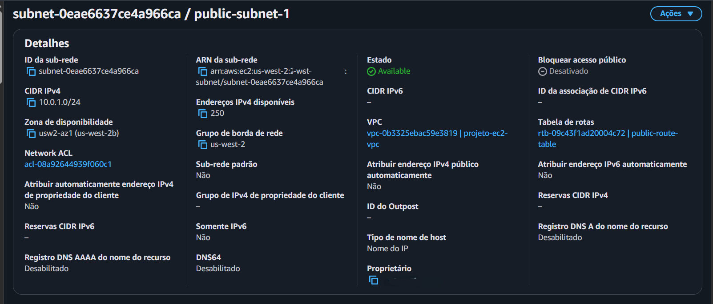
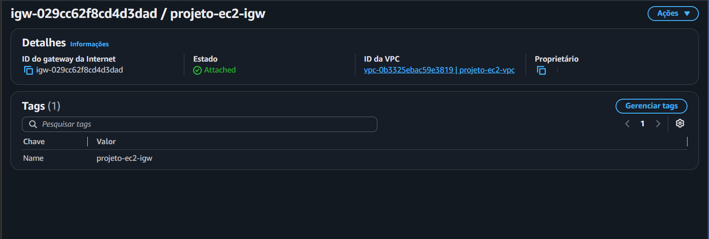
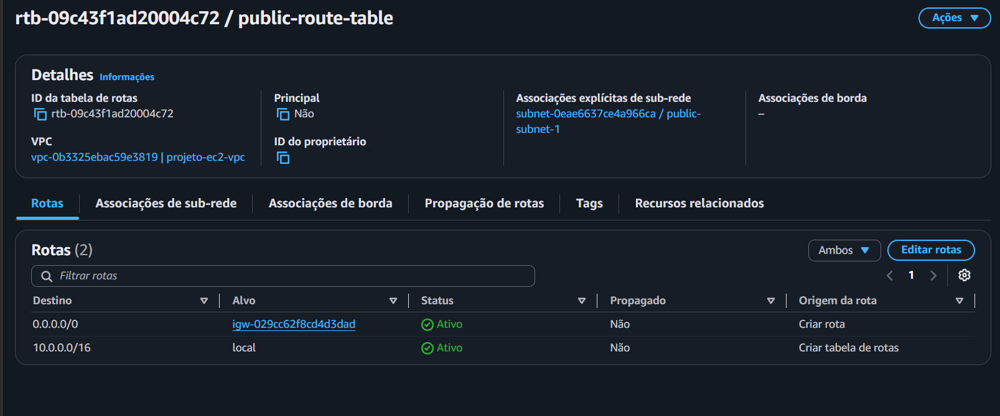
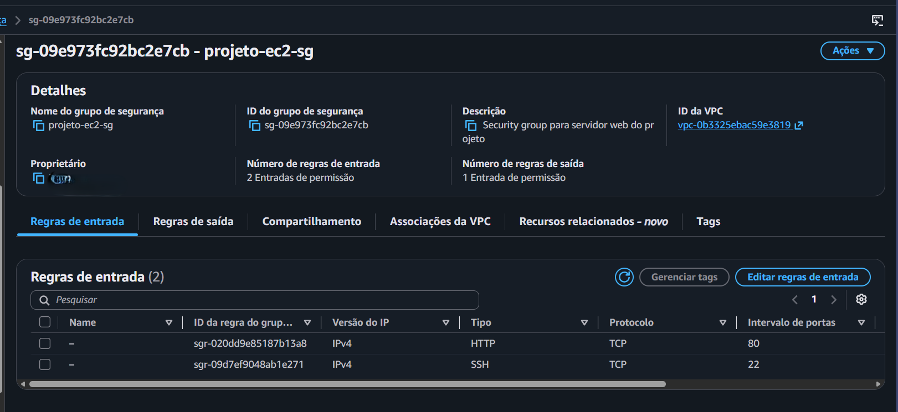
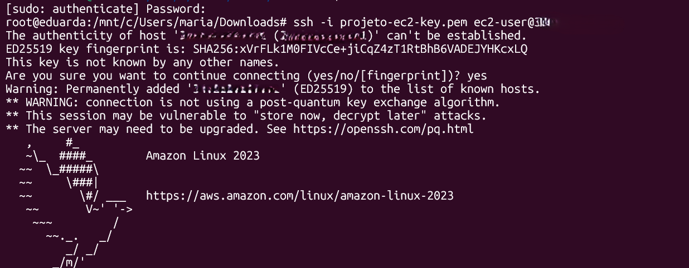
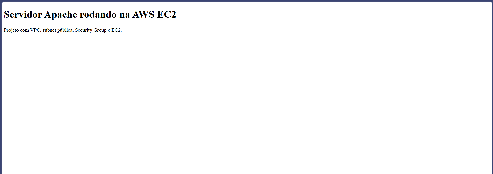
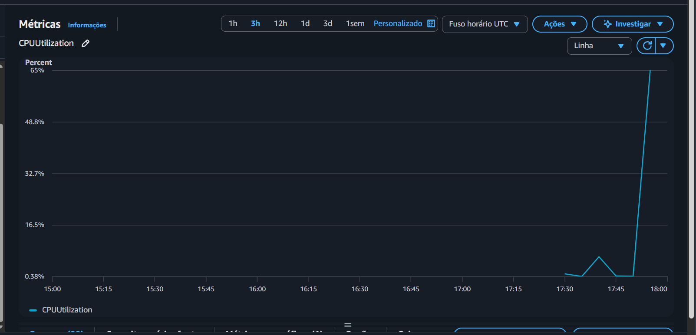
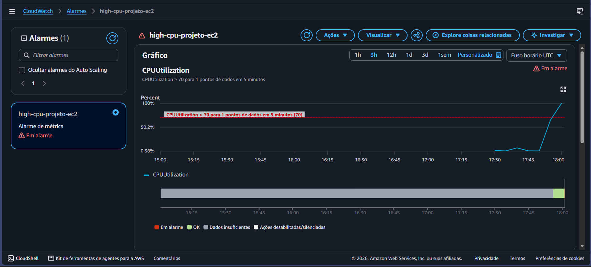

# Infraestrutura Web na AWS com EC2, VPC e CloudWatch

Projeto desenvolvido com o objetivo de praticar conceitos de infraestrutura em nuvem utilizando a AWS.

A aplicação consiste em uma instância EC2 executando um servidor Apache dentro de uma VPC própria, com subnet pública, roteamento para internet, regras de segurança e monitoramento utilizando Amazon CloudWatch.

Além da criação da infraestrutura, foi configurado um alarme de CPU e realizado um teste de carga para validar o monitoramento.

---

## Arquitetura

A arquitetura utilizada no projeto foi:

```text
Usuário
   ↓
Internet
   ↓
Internet Gateway
   ↓
Route Table
   ↓
Subnet pública
   ↓
Security Group
   ↓
EC2
   ↓
Apache HTTP Server
   ↓
CloudWatch
```

A instância EC2 foi disponibilizada em uma subnet pública, com acesso HTTP permitido pela porta 80 e acesso administrativo via SSH pela porta 22.

O Amazon CloudWatch foi utilizado para acompanhar a utilização de CPU e gerar um alarme quando o uso ultrapassasse o limite definido.

---

## Tecnologias e serviços utilizados

- Amazon Web Services
- Amazon VPC
- Amazon EC2
- Amazon CloudWatch
- Security Groups
- Internet Gateway
- Route Tables
- Amazon Linux 2023
- Apache HTTP Server
- SSH
- Linux
- WSL
- HTML
- Git
- GitHub

---

## Estrutura do repositório

```text
aws-ec2-web-infrastructure/
│
├── index.html
├── README.md
│
└── docs/
    ├── 01-vpc-criada.png
    ├── 02-subnet-publica.png
    ├── 03-internet-gateway.png
    ├── 04-route-table.png
    ├── 05-security-group.png
    ├── 06-cloudwatch-alarm.png
    ├── 07-ssh-ec2.png
    ├── 08-site-funcionando.png
    └── 09-cloudwatch-cpu.png
```

---

## 1. Criação da VPC

Foi criada uma VPC própria para isolar os recursos de rede utilizados no projeto.

Faixa IPv4 utilizada:

```text
10.0.0.0/16
```

Essa faixa permite criar subnets menores dentro da rede principal.



---

## 2. Criação da subnet pública

Dentro da VPC foi criada uma subnet com a seguinte faixa:

```text
10.0.1.0/24
```

A subnet foi utilizada para hospedar a instância EC2 responsável pelo servidor web.



---

## 3. Configuração do Internet Gateway

Para permitir comunicação entre a VPC e a internet, foi criado um Internet Gateway e anexado à VPC do projeto.



O Internet Gateway funciona como ponto de comunicação entre os recursos da VPC e a internet.

---

## 4. Configuração da Route Table

Foi criada uma tabela de rotas específica para a subnet pública.

A principal rota configurada foi:

```text
Destination: 0.0.0.0/0
Target: Internet Gateway
```

Essa rota permite que tráfego destinado à internet seja encaminhado através do Internet Gateway.

A tabela também contém a rota local da própria VPC:

```text
10.0.0.0/16 → local
```



---

## 5. Configuração do Security Group

Foi criado um Security Group para controlar o tráfego de entrada da instância EC2.

Foram utilizadas duas regras principais:

```text
HTTP
TCP
Porta 80
```

Utilizada para permitir acesso ao servidor web.

```text
SSH
TCP
Porta 22
```

Utilizada para administração remota da instância.

O acesso SSH foi configurado de forma restrita ao endereço IP autorizado, evitando exposição desnecessária da porta administrativa.



Essa configuração segue o princípio do menor privilégio, permitindo apenas o tráfego necessário para o funcionamento do projeto.

---

## 6. Criação da instância EC2

Foi criada uma instância EC2 utilizando Amazon Linux 2023.

A instância foi configurada dentro da VPC e subnet criadas anteriormente e recebeu um endereço IPv4 público para permitir acesso através da internet.

O acesso administrativo foi realizado utilizando autenticação por chave SSH.

---

## 7. Acesso via SSH

A conexão com a instância foi realizada utilizando WSL e SSH.

Exemplo do comando utilizado:

```bash
ssh -i projeto-ec2-key.pem ec2-user@IP_PUBLICO
```

Após a autenticação, foi possível acessar o ambiente Linux da instância remotamente.



Para operações administrativas, foram utilizados privilégios de superusuário através de `sudo`.

---

## 8. Instalação do Apache

Dentro da instância EC2 foi instalado o Apache HTTP Server.

Comandos utilizados:

```bash
sudo dnf update -y
sudo dnf install httpd -y
```

O serviço foi iniciado com:

```bash
sudo systemctl start httpd
```

E configurado para iniciar automaticamente com o sistema:

```bash
sudo systemctl enable httpd
```

O diretório utilizado para armazenar o conteúdo do site foi:

```text
/var/www/html
```

---

## 9. Página hospedada na EC2

Foi criado um arquivo `index.html` personalizado dentro do diretório utilizado pelo Apache.

O servidor passou a disponibilizar a página através do endereço IPv4 público da instância.



Esse teste confirmou o funcionamento conjunto de:

- VPC;
- subnet;
- Internet Gateway;
- Route Table;
- Security Group;
- EC2;
- Apache;
- acesso HTTP.

---

## 10. Monitoramento com CloudWatch

Após a configuração do servidor, foi utilizado o Amazon CloudWatch para acompanhar métricas da instância EC2.

Uma das principais métricas analisadas foi:

```text
CPUUtilization
```

Essa métrica representa o percentual de utilização da CPU da instância.



---

## 11. Criação do alarme de CPU

Foi criado um alarme no CloudWatch para identificar situações de alta utilização de CPU.

Configuração utilizada:

```text
Métrica: CPUUtilization
Estatística: Average
Período: 5 minutos
Limite: 70%
Condição: CPUUtilization > 70
```

O objetivo do alarme é identificar automaticamente situações em que o uso de CPU ultrapassa o nível esperado.

---

## 12. Teste de carga

Para validar o funcionamento do monitoramento, foi gerada uma carga temporária de CPU dentro da instância EC2.

Foi utilizada uma ferramenta de stress para aumentar artificialmente a utilização da CPU durante alguns minutos.

Exemplo:

```bash
stress --cpu 2 --timeout 300
```

Durante o teste, a métrica `CPUUtilization` aumentou significativamente.

Quando a média ultrapassou o limite configurado, o CloudWatch alterou o estado do alarme para:

```text
ALARM
```



Esse teste confirmou que o monitoramento estava funcionando corretamente e que o alarme conseguia identificar uma condição de alta utilização da instância.

---

## Fluxo do monitoramento

```text
EC2
   ↓
Aumento do uso de CPU
   ↓
CloudWatch coleta CPUUtilization
   ↓
CPU > 70%
   ↓
CloudWatch Alarm
   ↓
Estado ALARM
```

---

## Segurança

Durante o projeto foram adotadas algumas práticas básicas de segurança.

O servidor web utiliza a porta:

```text
80 - HTTP
```

O acesso administrativo utiliza:

```text
22 - SSH
```

A porta SSH não foi disponibilizada indiscriminadamente para toda a internet, sendo limitada a um endereço autorizado.

Também foi utilizado um par de chaves para autenticação SSH, evitando autenticação administrativa por senha.

---

## Conceitos praticados

Durante o projeto foram praticados:

- criação de VPC;
- endereçamento CIDR;
- criação de subnet;
- subnet pública;
- Internet Gateway;
- tabelas de rota;
- rota padrão `0.0.0.0/0`;
- Security Groups;
- controle de portas;
- princípio do menor privilégio;
- criação e configuração de EC2;
- endereço IPv4 público;
- autenticação com chave SSH;
- administração Linux;
- utilização do WSL;
- instalação e gerenciamento do Apache;
- hospedagem de conteúdo em EC2;
- monitoramento utilizando CloudWatch;
- métricas de CPU;
- configuração de alarmes;
- teste de carga;
- troubleshooting de rede e permissões.

---

## Aprendizados

O projeto permitiu compreender como diferentes componentes da AWS precisam trabalhar em conjunto para disponibilizar uma aplicação na internet.

A criação da EC2 foi apenas uma parte da solução.

Também foi necessário configurar corretamente:

```text
VPC
→ Subnet
→ Internet Gateway
→ Route Table
→ Security Group
→ EC2
→ Apache
→ CloudWatch
```

Além da infraestrutura, o projeto permitiu praticar administração de um servidor Linux e identificar problemas reais relacionados a rede, segurança, permissões e monitoramento.

---

## Desenvolvedora 
Maria Eduarda Santana
